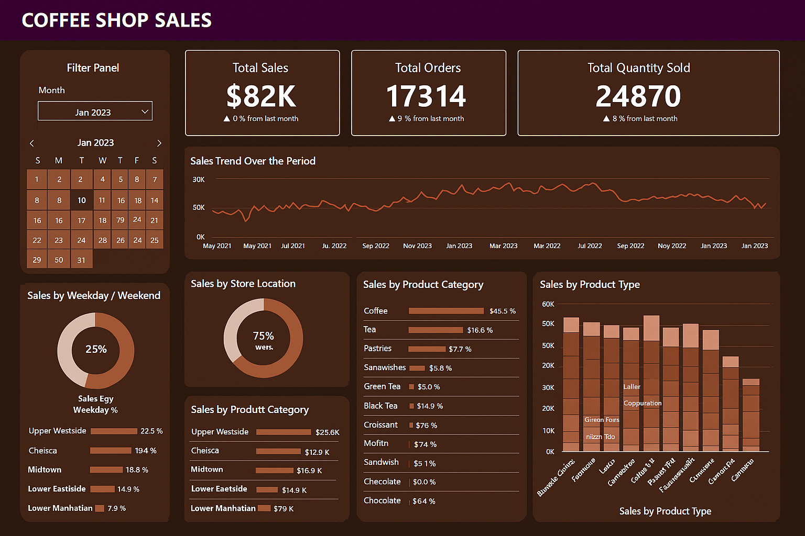

# ☕ Coffee Shop Sales Analysis — SQL + Power BI

This project presents a complete analysis of sales data from a fictional coffee shop chain. Using SQL for data transformation and Power BI for data storytelling, the objective was to uncover trends, optimize product performance, and provide actionable insights that drive smarter business decisions.

---

## 📈 Business Problem

Coffee shops are thriving social hubs, but to stay competitive, they need more than just great coffee. Our goal was to decode the sales data and answer key business questions:

- How can we increase the Month-over-Month (MoM) growth of items sold?
- Which products are top performers, and which need strategic support?
- How closely is revenue tied to quantity sold?
- What seasonal or daily patterns influence our sales?
- Which store locations and hours are most profitable?

---

## 🛠 Methodology

We followed a structured approach:

1. **Data Cleaning** – Column renaming, datatype conversions (dates & times)
2. **Exploratory Analysis** – Trends over time, best-selling products, location-wise performance
3. **SQL Queries** – Extracted KPIs and patterns (see below)
4. **Power BI Visualization** – Created an interactive dashboard with KPIs, heatmaps, and comparative views

---

## 🔍 SQL Queries Used

```sql
-- Total Sales, Orders, and Quantity Sold
SELECT ROUND(SUM(unit_price * transaction_qty)) AS Total_Sales FROM coffee_shop_sales WHERE MONTH(transaction_date) = 5;
SELECT COUNT(transaction_id) AS Total_Orders FROM coffee_shop_sales WHERE MONTH(transaction_date) = 5;
SELECT SUM(transaction_qty) AS Total_Quantity_Sold FROM coffee_shop_sales WHERE MONTH(transaction_date) = 5;

-- MoM Quantity Sold Comparison
SELECT 
   MONTH(transaction_date) AS month,
   ROUND(SUM(transaction_qty)) AS total_quantity_sold,
   (SUM(transaction_qty) - LAG(SUM(transaction_qty), 1) OVER (ORDER BY MONTH(transaction_date))) /
   LAG(SUM(transaction_qty), 1) OVER (ORDER BY MONTH(transaction_date)) * 100 AS mom_increase_percentage
FROM coffee_shop_sales
WHERE MONTH(transaction_date) IN (4, 5)
GROUP BY MONTH(transaction_date)
ORDER BY MONTH(transaction_date);

-- Product and Category Analysis
SELECT product_category, ROUND(SUM(unit_price * transaction_qty),1) AS Total_Sales
FROM coffee_shop_sales
WHERE MONTH(transaction_date) = 5
GROUP BY product_category
ORDER BY Total_Sales DESC;
```

*(More queries available in `Project_presentation.pdf`)*

---

## 📊 Key Insights

- **KPI Summary**:  
  - Total Sales: `$157K` (+31.8% vs. previous month)  
  - Total Orders: `33,527` (+32.3%)  
  - Total Quantity Sold: `48,233` (+32.3%)

- **Sales Timing Trends**:  
  - Peak hours: **8-10 AM** (especially Mon–Wed)  
  - Weekdays account for 74%+ of total revenue

- **Top Performing Categories**:  
  - Coffee ($60.3K), Tea ($44.5K), Bakery ($18.5K)  
  - Tea and Bakery showed highest growth potential

- **Location Performance**:  
  - Hell’s Kitchen slightly leads at $52.6K  
  - All stores show consistent growth (~30–33%)

---

## 📌 Dashboard Preview

<p align="center">
  
</p>

---

## 📁 Files Included

- `Project_Presentation` – Full SQL query set for data analysis
- `Coffee_sales_Dashboard.png` – Enhanced visual preview of the dashboard

---

## 👨‍💻 Author

**Yashpal Singh Chavda**  
[LinkedIn](https://www.linkedin.com/in/yashpal0502/) | yashchavda515@gmail.com
